# Setting up a dev environment on an Apple Silicon Mac

Because Apple Silicon Processors (M1, M2, etc..) are arm64 based instead of x86, there are some challenges
with getting a efficient FMS running for development. These steps should walk you through the requirements
and steps to getting an environment ready for setup.

For this, you absolutely want to latest version of Windows 11. Windows 11 Update 24H2 instroducted a much
more efficient x86->arm64 translation layer which can make your windows VM quite speedy, even when the FMS
and SQL server are all running as x86 apps being translated live. You can attempt to install a x86 VM instead,
however in my experience this is so horrifically slow that Windows just times out on most common tasks before you
can even attempt to start the FMS.

## 1. Setup Windows

### Download Windows 11
.
For this, we will be using [CrystalFetch](https://github.com/TuringSoftware/CrystalFetch). The easiest ways
to download this application are:

- `brew install --cask crystalfetch`
- [From the Mac App Store](https://apps.apple.com/us/app/crystalfetch-iso-downloader/id6454431289?mt=12)

You want to download the latest version of Windows 11 in Apple Silicon format, as follows:

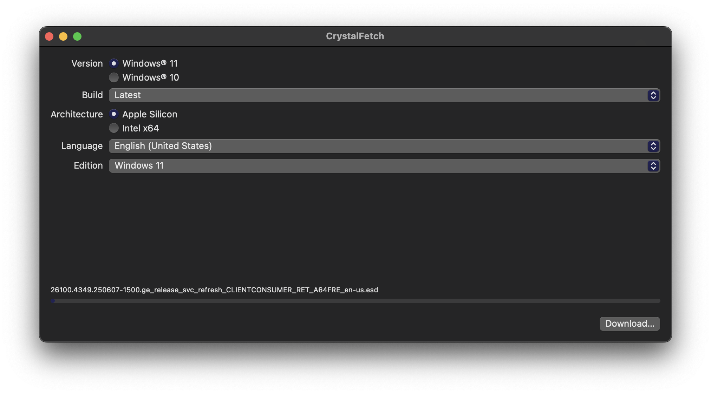

Accept the terms and save the ISO file to a location like your Downloads folder.

### Install UTM

For efficient virtualization of Windows, the current best free option is using UTM, which uses Apple's
virtualization framework underneath. This should ensure that even low powered macs (like Macbook Airs)
should be able to run Windows & the FMS without issue.

You can install UTM from
- `brew install --cask utm`
- [The UTM website](https://mac.getutm.app/)
- [From the Mac App Store](https://apps.apple.com/us/app/utm-virtual-machines/id1538878817)

> [!NOTE]
> The Mac App Store version of UTM does have a cost associated with it, but this helps support UTM's
> ongoing development.

The following instructions are for UTM version 4.6.5 and may change in the future with UTM updates.

### Install Windows

#### Create the VM in UTM

First, we need to create the VM in UTM:

1. Launch UTM
2. Click "Create a New Virutal Machine"
3. Select "Virtualize" when asked what type of VM to create.
4. Select "Windows"
5. Select your ISO image downloaded earlier for the boot ISO, and leave other options as default.
6. Select however much RAM and CPU you want to allocate to your FMS VM. The defaults have been fine in my experience.
7. Select however much storage you want to allocate to the FMS. The default of 64 GB is more than enough.
   UTM's drives in virtualized mode are "sparse files", meaning unused space will not take space on your hard drive.
8. Select a shared folder to share between your VM and macOS.
   You do not need to select a Shared Directory on this step, as its value for the FMS is limited. The FMS
   installer is too large for this shared drive so we will need a workaround later for that installer anyway.
9. Name your VM on this step something memorable, like "FMS".
10. Hit "save" and your VM is created!

#### Install Windows itself

Click the big "play" button UTM has put on the VM you just created. When the UTM bootloader shows up with text
saying "Press any key to boot into CD/DVD", press any key to make sure you end up in the Windows installer.
For any subsequent restarts, you don't want to boot into the CD/DVD install media and after it restarts the
first time into the installed OS, you can safely remove the media from the UTM management screen.

From here, this is a standard VM installation, and there's nothing special about being on UTM or Apple Silicon.
There are only one partition to use for Windows that will show up.

After Windows starts rebooting into the OOBE, UTM and Crystalfetch should have modified the image to make it such
that you do not need to log into a Microsoft account. There aren't many options to pick from - just setup a local
account (I like to just call it "FMS" with "password") and call it a day.

#### Install UTM tools (optional)

Assuming you selected "Install UTM guest tools", likely windows will autostart the UTM tools installer once
you get into Windows. If not, check your E: drive and click the installer application within. The UTM guest
tools make things like copy and pasting and altering your screen resolution much easier.

# 2. Install SQL Server

Due to... quirks in Windows on ARM, unfortunately we can't just run the FMS installer by itself. On a x86
computer, the FMS installer will run and setup the SQL Server Express install behind the scenes without you having
to interact with it, but that installer is broken on ARM64 installs. Instead, we have to use a special installer
for ARM64 computers.

Copy and paste the following link into Edge to download a special installer:
`https://github.com/jimm98y/MSSQLEXPRESS-M1-Install/releases/download/v0.0.2/Sql2022ExpressARM64.exe`

Most browsers will throw a warning up saying that EXEs are dangerous. On edge, click the three dots, click "keep",
then "show more", then "keep anyway".

Click the file to open, then hit "more info" on the Smartscreen promptto get the "run anyway" button to appear.
And then hit "Run" again on the second security warning.

On the first screen, make sure you alter the instance name to be `FRCSQLEXPRESS`. This is the name that FMS uses
and will prompt the FMS installer to skip attempting to setup SQL server itself.

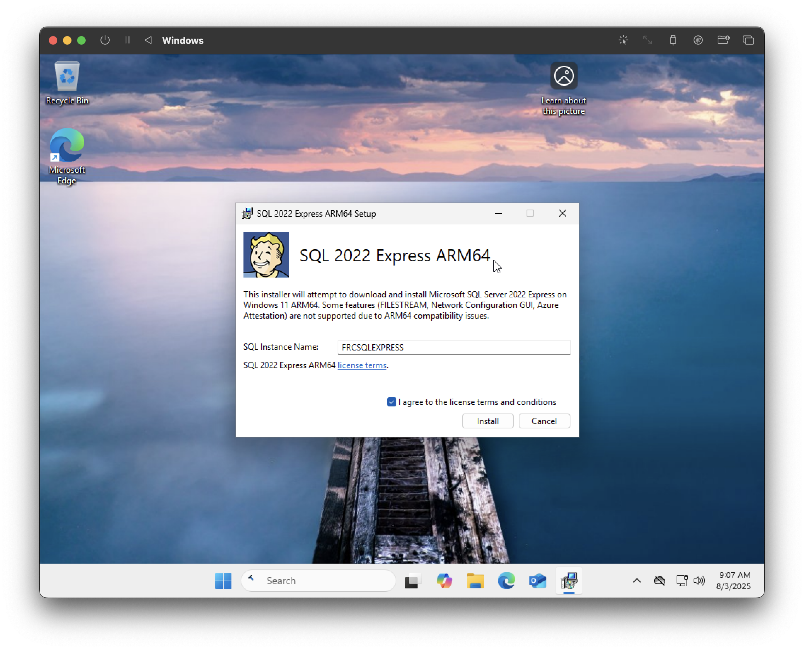

This step will take a while - be patient! It may seem like it's stalled at times but just give it a second.
It'll end up launching the SQL server installer twice, with the first time intentionally failing.

# 3. Install FMS

Once you download your FMS installer EXE, unfortunately there's no obvious way to get it into your VM.
As mentioned earlier, the shared folder functionality (using the default SPICE share) doesn't work on packages
that big, and using the libvirt sharing always results in a blue screen for me.

The easiest solution I've found is spinning up a quick Python HTTP server to transfer files. Create a folder
to share on your HTTP server (i'm using a folder in my Downloads folder called `UTM Share`)

```
cd ~/Downloads/UTM\ Share
python3 -m http.server 8080
```

Next, get your mac's private IP address through the system settings app or `ifconfig`. For example, mine
is `192.168.0.197`. Once you've started the python file server above, open Edge inside your VM and point
it to `http://192.168.0.197:8080`, which should present the files in that folder.

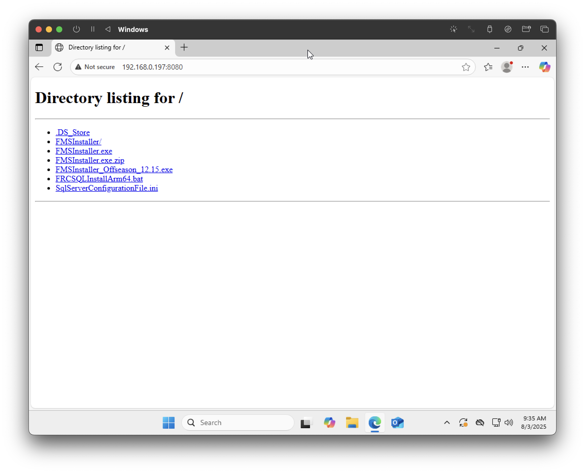

This should be a very quick download since the download isn't leaving your device.

Next, go through the same dance with Edge to keep your files, and then launch the FMS installer. There's
nothing special to do in the installer - just launch it and proceed through. It shouldn't attempt to install
SQL server at all.

After that, double click on the FMS icon on your desktop to start your test FMS system, and you should be good!

## Quirks/Tips

### Manually starting the FMS Web Service

In general it seems like the web serivce for the FMS doesn't start up the first time properly and FMS will
throw an error saying it can't be started. Just go to the "Services" app (just searching Services in the
start menu will get you there quickly), and find `FMS.FielServer.Web`. Right click and hit "Start".

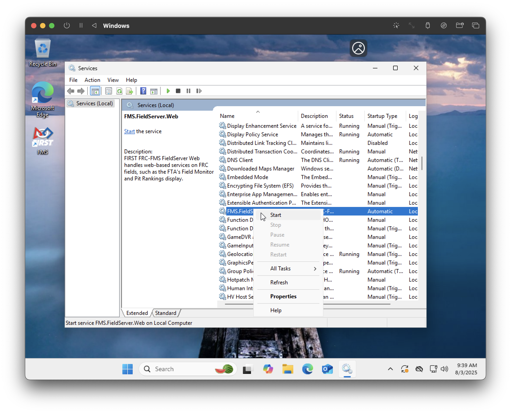

### Starting SQL Server after a Restart

After you restart the VM, the SQL Server will not start back up on it's own. To start up the SQL Server
instance manually, open up the "SQL Server Configuration Manager", select "SQL Server Services" in the menubar
on the left. Then find "SQL Server (FRCSQLEXPRESS)", right click it and hit "Start".

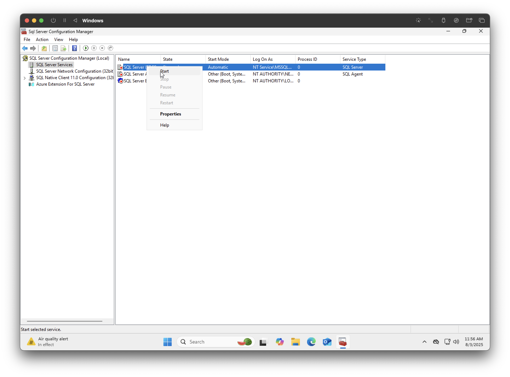

### Selecting a USB Flash Drive for FMS

Most versions of FMS offseason enforce the use of a USB Flash Drive as a backup location. Creating a flash drive
for use in UTM is pretty difficult, though not impossible. However, the easiest solution is to cheese this by
simply selecting a external drive/volume that's not readable (like the UTM tools installer), causing FMS to
crash. Then, start it back up and you'll find your DB created! To the FMS developers: I'm very sorry for this.

### Networking setup for a real-ish FMS network

For testing and interfacing, ideally you want to be able to interact with the FMS at 10.0.100.5 just like a real
field network. Thankfully, since we're running windows in a VM, that's pretty easy to do! Make sure your VM is
fully shut down, and then click edit (or the settings icon) on your VM in UTM. Go to the "Network" tab in the
edit dialog, and then set the settings to something like this:

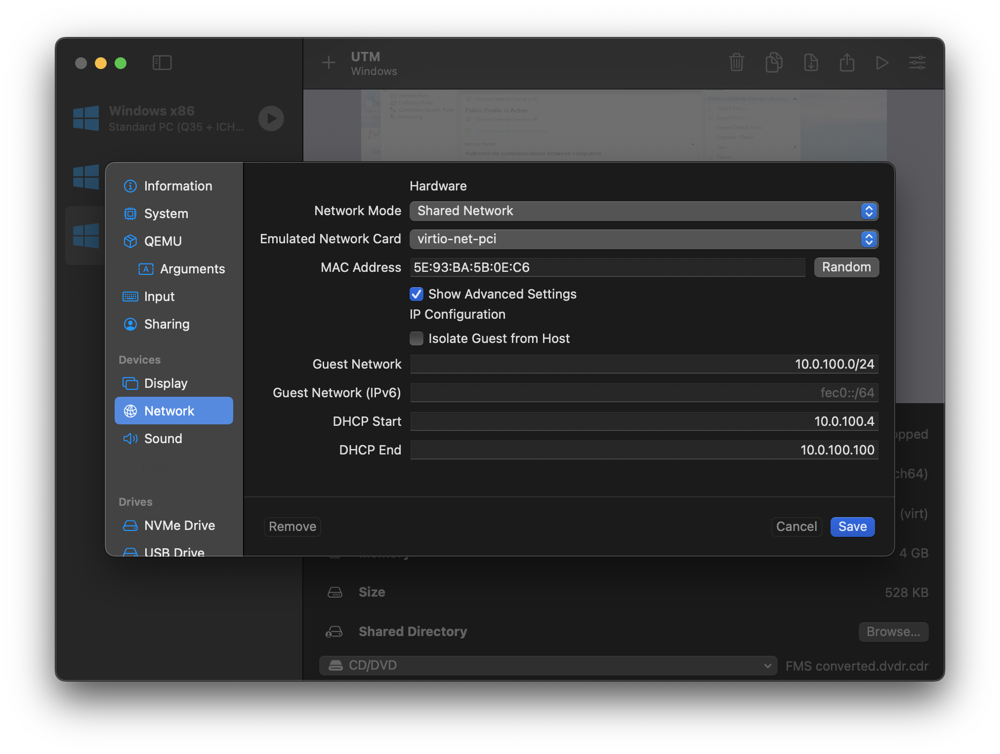

The DHCP range os 10.0.100.4-10.0.100.100 is intentional - the first address in the DHCP pool is used as the
gateway device, so your windows host will pick up the .5 address. The MAC address can be whatever - it does not
to match the one in the screenshot.

You will also need to alter the Windows Firewall settings from their defaults to be able to access the web
server from the Mac host:

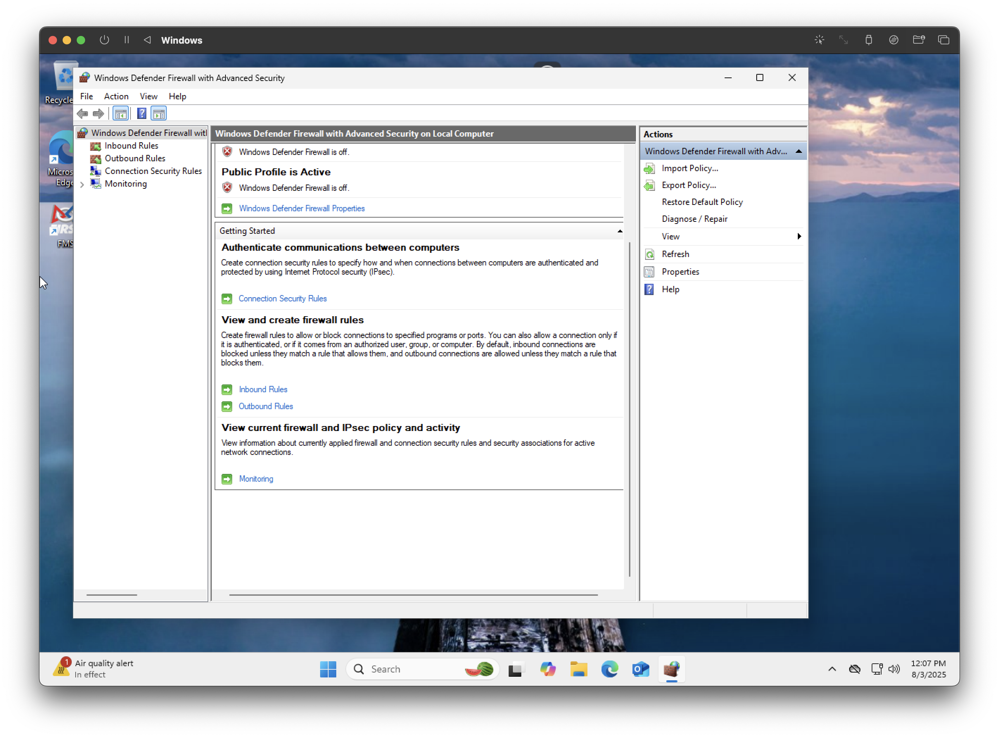

# 4. Install SSMS and create a Token

To create a token for development, you will need the SQL Server Management Studio (SSMS), however just like SQL
Server itself, the installer for this doesn't work on Arm64-based Windows hosts. Thankfully, somebody has
created an installer that works on Arm64.

## Install SSMS

1. Paste in `https://github.com/snickler/Posh-SSMSInstaller/blob/main/Download-SSMS.ps1` in Edge, and click the
   Download button in the top right.
2. Open Powershell (NOT a regular command prompt) as administrator.
3. Enable Powershell script execution with `Set-ExecutionPolicy unrestricted`
4. `cd Downloads`
5. Run `./Download-SSMS.ps1`
6. When promped, type `R` and press enter to run the script. This will take a while to execute - be patient!
7. If prompet to download a NuGet provder, hit "Y" and enter.
8. When done, restart to complete the SSMS installation.

## Create a FTA Token

After restarting, launch the SQL Server Management Studio. When opened, click "Skip and add accounts later" to
avoid signing in. The following instructions are done with the new connection dialog, so click Yes if prompted
to use the new connection dialog.

Click "Browse" at the top of the connect dialog, then expand on the "Local" category. Select the one ending in
`FRCSQLEXPRESS` which should populate the options below, and then hit "Connect", making sure to select "Trust
Server Certificate".

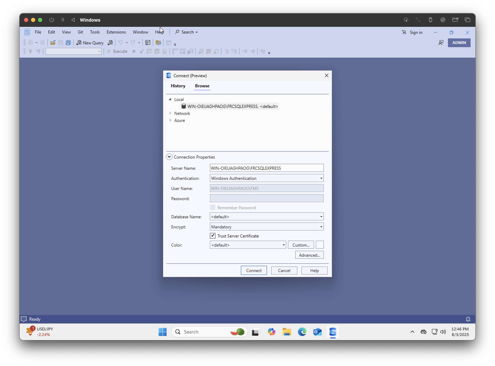

Next, click "New Query" in the toolbar and paste in the following SQL query to create a token, making sure
to replace "Your Username" with something for yourself.

```sql
USE [FRC_Prod_2025_V1_System]
GO

INSERT INTO [dbo].[FieldApiAuth]
           ([AuthorizationKey]
           ,[UserName]
           ,[AppType]
           ,[IsActive]
           ,[Organization]
           ,[ContactName]
           ,[ContactEmail]
           ,[CreatedOn]
           ,[CreatedBy]
           ,[ModifiedOn]
           ,[ModifiedBy])
     VALUES
           (NEWID()
           ,'Your Username'
           ,'FTA'
           ,1
           ,'FTA Notepad'
           ,'Field Technical Advisor'
           ,'fta@example.com'
           ,GETDATE()
           ,'System'
           ,GETDATE()
           ,'System')
GO
```

Then, hit "execute" in the toolbar to create your API User:

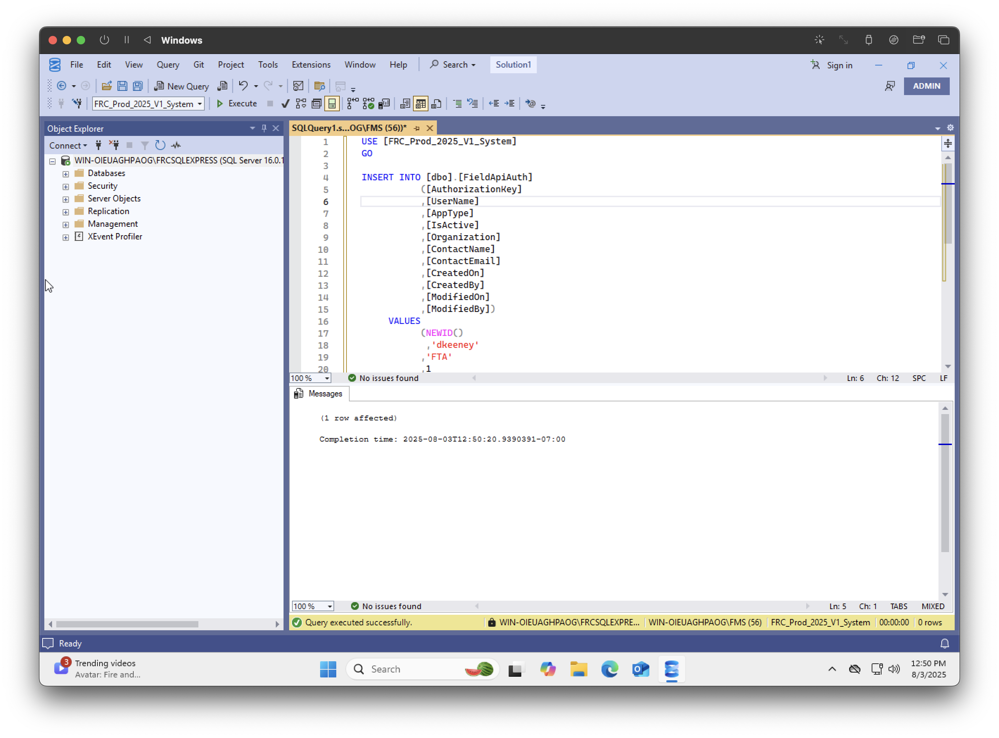

Next, we'll need to get the contents of the table that we just added to. Find the "FieldApiAuth" table in the
sidebar, right click and click on "Select".

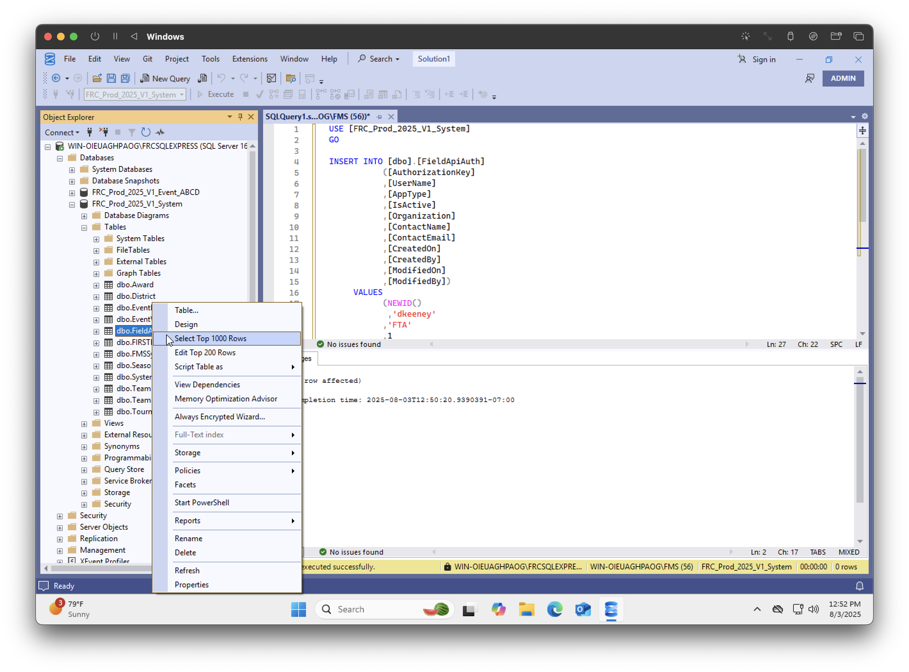

That will then result your Authorization Key and User Name to use within the application:

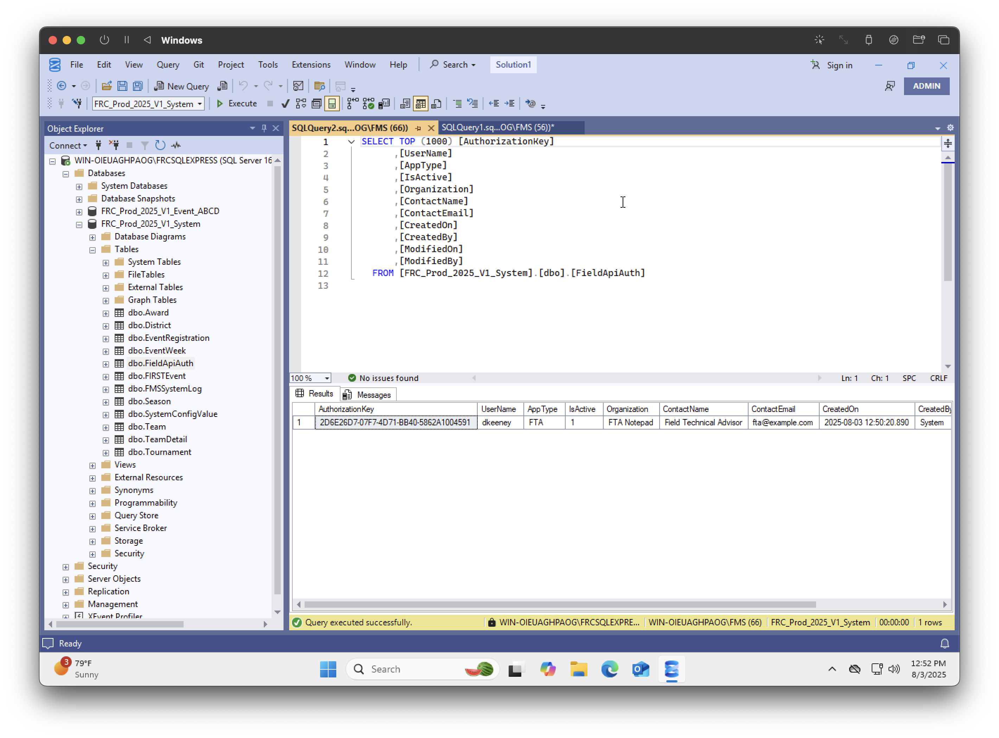
